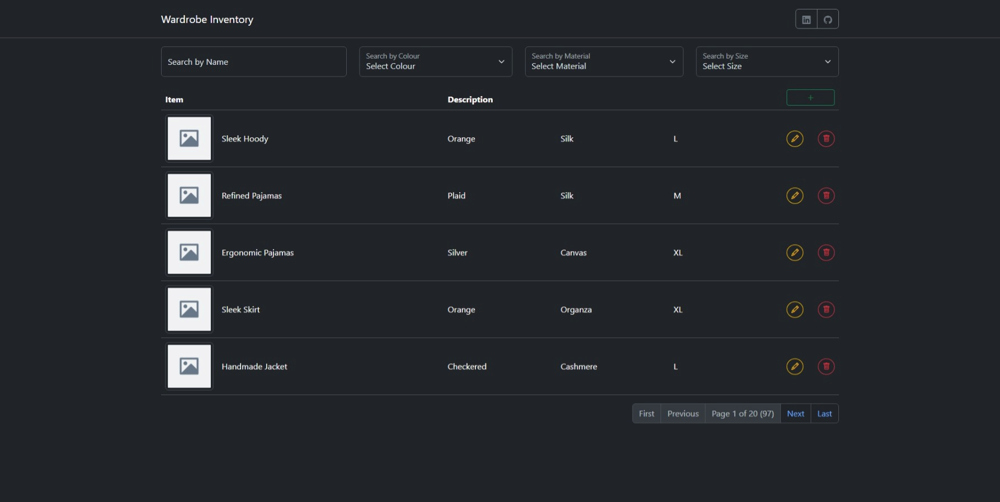
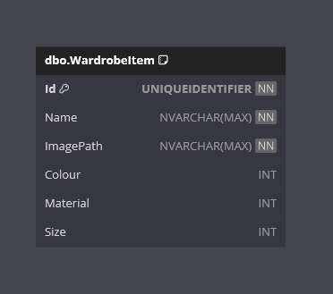

    
    <h1>Wardrobe Inventory</h1>

Welcome to the **Wardrobe Inventory** App!

This is a .NET project designed to demonstrate building a Blazor WebAssembly application with Entity Framework Core and a focus on pure C# development.

It allows users to manage their wardrobe items. They can create, update and delete items, and also upload an image of the item.

The web front end is delivered by Blazor Web Assembly and utilises Bootstrap.
The API back end is delivered by .NET and provides the endpoints to interface with an SQLite database.

## Requirements

This application fulfills the following [The C# Academy - Wardrobe Inventory](https://thecsharpacademy.com/project/39/wardrobe-inventory) project requirements:

- [x] This is an application where you should store and retrieve wardrobe data..
- [x] You should use a Blazor Webassembly project.
- [x] You can choose whatever database solution you want: Sqlite, SQL server or whatever you're comfortable with.
- [x] Since we'll only have basic CRUD operations, you should use Entity Framework.
- [x] Your database should have a single table. The objective is to focus on learning Blazor, so we should avoid the complexities of relational data.
- [x] Users of your app need to be able to upload pictures of wardrobe items.
- [x] You CAN'T USE Javascript interop. The objective is to stay away from JS, even though it's still possible to use it.

## Features

- **Blazor**:
  - The web front end has been built with Blazor Web Assembly v9.
- **Bootstrap**:
  - The web UI is styled using Bootstrap v5.3.3.
- **Pagination**:
  - The wardrobe item table is paginated to only show 5 records at a time.
- **Form Validation**:
  - Form validation will ensure a form is valid before submission, and validation errors will be displayed on the associated control.
- **Toasts**:
  - Toasts are used to display success, error, and warning messages.
- **.NET API**:
  - The front end interfaces with the back end through an API layer.
- **Entity Framework Core**:
  - Entity Framework Core is used as the ORM.
- **SQLite**:
  - SQLite is used as the data provider.
- **Responsive Web Design**:
  - A user-friendly web interface designed to work on various devices.
  
## Technologies

- .NET
- Bootstrap
- HTML
- CSS
- Entity Framework Core
- SQLite

## Getting Started

**IMPORTANT NOTE**:

Database migrations are not implemented.

On start-up of the **API** application, `context.Database.EnsureCreated();` is called to ensure the database and schema is created.

### Prerequisites

- .NET 9 SDK.
- A code editor like Visual Studio or Visual Studio Code.
- A database management tool (optional).

### Installation

1. Clone the repository:

   - `git clone https://github.com/chrisjamiecarter/wardrobe-inventory.git`

2. Navigate to the API project directory:

   - `cd src\WardrobeInventory.Api`

3. Build the application using the .NET CLI:

   - `dotnet build`

4. Navigate to the Web project directory:

   - `cd src\WardrobeInventory.Blazor`

5. Build the application using the .NET CLI:
   - `dotnet build`

### Running the Application

1. You can run both applications from Visual Studio, using the **Multiple Startup Projects** option and selecting the \*.Api and \*.Blazor projects.

OR

1. Run the API application using the .NET CLI in the API project directory:

   - `cd src\WardrobeInventory.Api`
   - `dotnet run`

2. Run the Web application using the .NET CLI in the Web project directory:
   - `cd src\WardrobeInventory.Blazor`
   - `dotnet run`

## Usage

YouTube Video Demonstration:

## How It Works

- **Web Project**: This project uses Blazor Web Assembly v9 to run .NET code inside you web browser.
- **Web Design**: This project uses Bootstrap v5.3.3 to style the app and provide a responsive web design.
- **API Project**: HTTP requests are used to interface the web and api projects.
- **Wardrobe Items**: A paginated table of Wardrobe Items is displayed as the home page of the web application.
- **Wardrobe Item**: A Wardrobe Item can be created/updated/deleted by clicking the appropriate action button from the table view.
- **Image Files**: An Image File can be uploaded when creating/updating a wardrobe item. There are size and mime type limits on this file.
- **Data Storage**: A new SQLite database file is created in the run-time directory and the required schema is set up at run-time, or an existing SQLite database file is used if previously created.
- **Data Access**: Interaction with the database is via Entity Framework Core.
- **Mock Data**: This project will automatically generate a selection of fake data using the [Bogus](https://github.com/bchavez/Bogus) package.

## API Endpoints

The Wardrobe Inventory API provides a set of endpoints for managing wardrobe items and image files.

It uses OpenAPI for documentation, and Scalar for the API platform, use the `/scalar/v1` endpoint when the API is running to view the API documentation in your browser. All responses follow RESTful standards with appropriate status codes.
See the [API Documentation](./_resources/wardrobe-inventory-v1.json) for more information.

## Database

---

**_Happy Wardrobe Inventory Managing!_**
